# 第八章 设置

<ImageViewer />

## 8.1 权限设置

### 8.1.1 目前锦蝶金融版系统默认的角色
**管理员**：所有功能均可使用，可以看到权限范围内的数据，并且做导出和删除，建议分配给公司主要负责人。

**总经理**：所有功能均可使用，可以看到权限范围内的数据，不能做导出和删除。

**营销中心各角色**：按照权限分类【普通、部门、中心、公司】划分数据范围，如营销1组的营销主管+部门权限，可以看到营销1组团队内部客户，可以下发任务和浏览本团队数据报表；营销专员+普通权限，仅可查看自己名下的客户。

**做单中心各角色**：按照权限分类【普通、部门、中心、公司】划分数据范围，如渠道1组的做单主管+部门权限，可以看到渠道1组团队内部客户，可以下发任务和浏览本团队数据报表；做单专员+普通权限，仅可查看自己名下的客户。

**财务会计**：系统默认配置公司财务角色。

**总机客服**：系统默认配置公司总机角色，接听总机热线，分配线索。

**行政人事**：系统默认配置公司行政角色，拥有管理公告，人事助手，确认到店等功能。

### 8.1.2 目前锦蝶金融版系统也支持自定义角色
说明：具体每个角色的数据权限和页面权限，通过【所属部门+权限分类+页面权限设置】控制

在设置->权限设置->角色管理，创建角色+添加页面

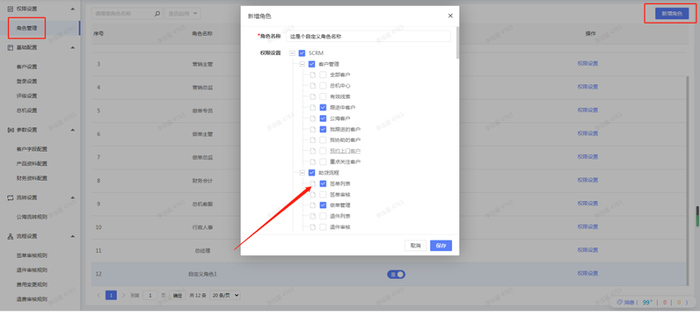

说明：
1. 角色登录系统所展示的菜单结构由权限设置页面控制
2. 按照角色所属部门及权限分类【普通、部门、中心、公司】划分数据范围
3. 按照流程规则设置划分业务端【包含签单、退件、费用变更、退费、报销、报完结审核】审核权限

## 8.2 基础设置

> 初次使用系统前，未设置基础规则与录入基础数据，建议先通过锦蝶金融版系统电脑端，由最高权限用户（注册开通系统人员）设置基础规则，再进行日常功能操作与信息录入。

### 8.2.1 客户设置
> 配置员工名下最大客户总数、配置我的客户/公海客户导入轮呼限制时间、设置标准利率、添加微信上限、自定义公司 logo等。

### 8.2.2 公海设置
> 对于有些企业，不同销售团队跟进的客户公海是不共享的。比如：一战区销售部放弃跟进的客户，只能丢在一战区公海，由一战区其他销售领取跟进，不允许二战区或其他战区的销售领取。为了满足上述场景，我们增加了“多公海”功能。

**如何设置**：点击“设置>基础配置>公海设置”，即可管理企业的所有公海池。每个公海可以设置不同的适用部门。

PS：根据员工所属部门、权限分类划分公海数据。比如：新建一战区销售一部公海池、一战区销售二部公海池，员工所属部门为销售一部；权限分类为普通或部门则只能看到销售一部公海池数据，权限分类为中心则可以看到一战区所有部门公海池数据，权限分类为公司，则所有公海池数据均可看到。

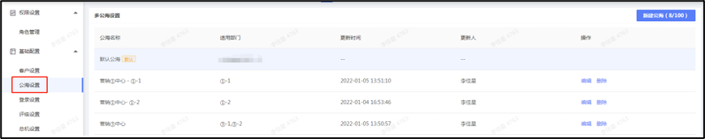

**回收公海**：手动点击【回收到公海】的时候，可以把客户回收到自己有权限的公海里

**导入/新建客户 - 导入公海**：若你直接新建或者导入公海客户，则需要选择客户的所属公海。
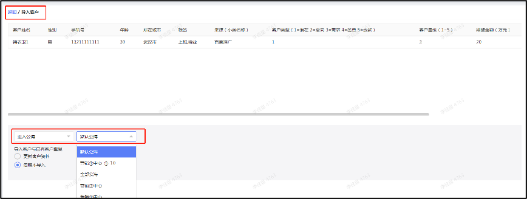
**公海转移**：企业管理员可在公海筛选不同公海池数据进行转移维护。
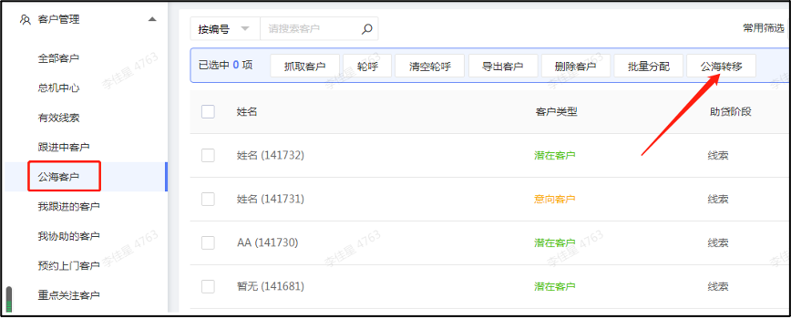
PS:若客户跟进人有多个公海，会按公海池顺序回收到排在上的公海；若跟进人没有公海，会回收到默认公海中。

多公海设置可拖拽排序：

### 8.2.3 登录设置
> 多维度设置登录限制。

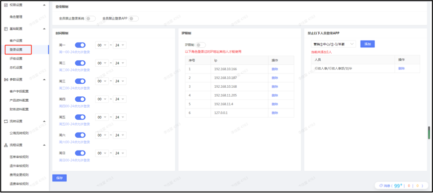

### 8.2.4 评级设置
> IPAD谈单专属，根据客户资质自动打分评级。

### 8.2.5 总机设置
> 高级版专属，配置总机热线接听规则。

## 8.3 参数设置
> 管理客户基础资料、产品基础资料、财务基础资料。

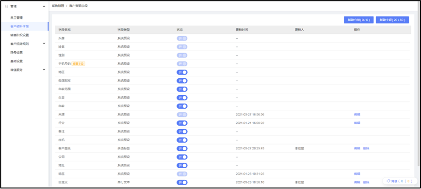

### 8.3.1 客户字段配置

**客户字段**
1. 系统默认字段：常用客户资料字段
2. 新建字段：字段不够用或需要自定义字段名称，通过新建字段功能，管理客户资料字段，你可以在“系统管理-》客户资料字段”页面，点击右上角按钮去【新建字段】，并移动到合适的位置

**手动增加字段**

支持手动增加单行文本，多行文本，数字，单选标签，多选标签，日期，时间，日期+时间，附件多类型的字段。可以根据自己的需求自定义所需的字段

step1：进入客户资料字段设置

step2：点击新增字段

step3：输入需要的字段名称，字段类型。如：单行文本

step4：点击拖动标签，将字段移动到特定的位置

step5：在客户列表页面，点击设置并选中字段在列表中展示
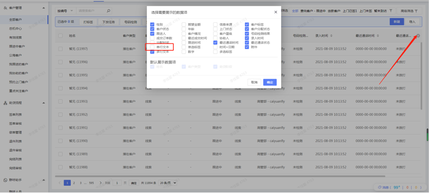
Step6：刷新后就可以在客户资料中查看到

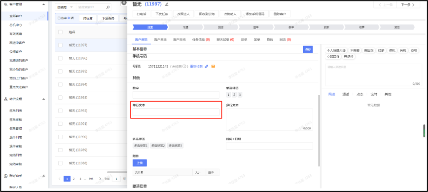
默认查重字段：一旦录入相同手机号码的客户，不允许新建。

**信息来源**：新增信息来源，支持添加二级信息来源。

step1：进入客户资料字段设置
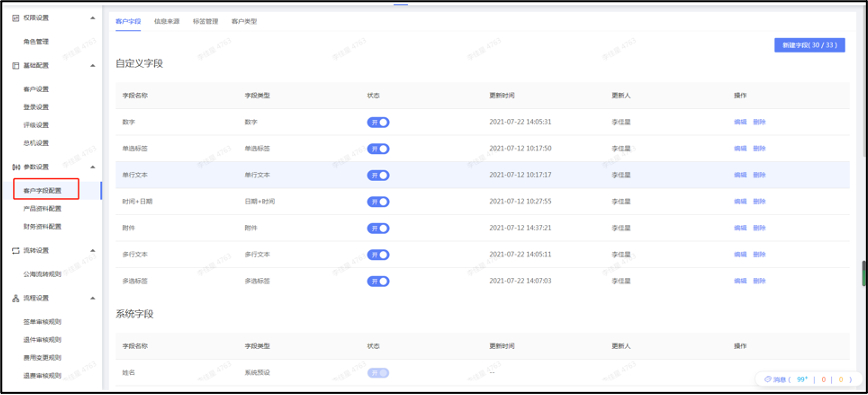
Step2：切换至“信息来源”，点击新增信息来源

step3：输入需要的大类名称，字段类型。如：信息来源大类

Step4：选择所属分类（大类名称），输入需要的小类名称，字段类型。如：信息来源小类，如需计费可以设置线索单价。
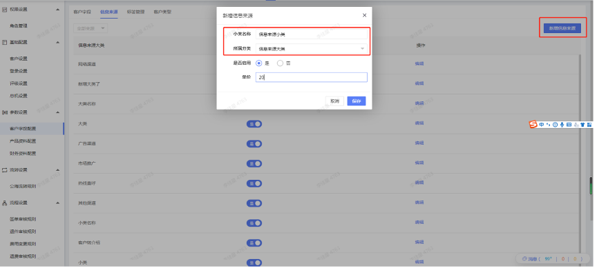
Step5：点击拖动标签，将字段移动到特定的位置
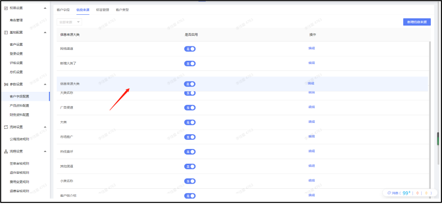
Step6：刷新后就可以在新建客户资料中查看到啦~
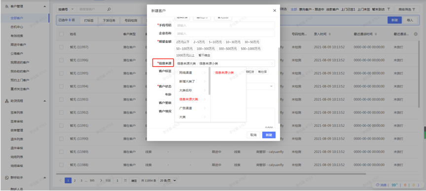

**标签管理**：新增客户标签。

step1：进入客户资料字段设置

Step2：切换至“标签管理”，点击新增标签
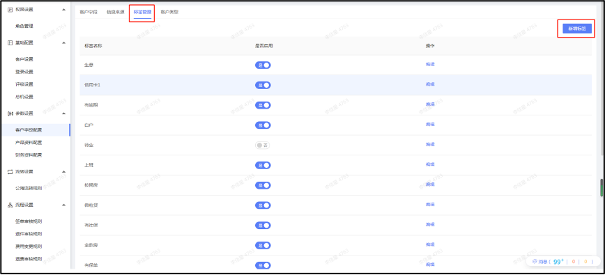
step3：输入需要的标签名称，字段类型。如：上班族
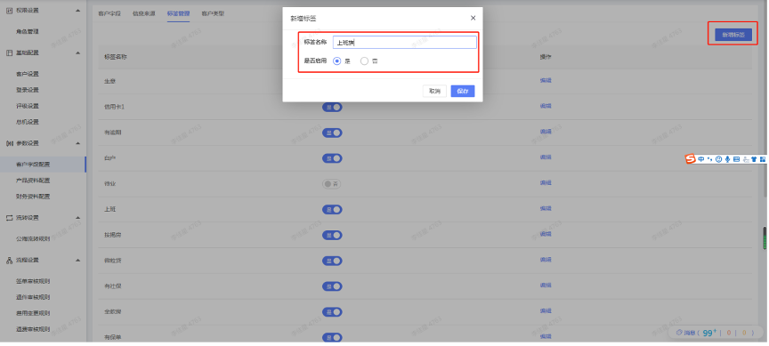
Step4：点击拖动标签，将字段移动到特定的位置

Step5：刷新后就可以给客户打上准确的标签啦~

**客户类型**：系统默认大类名称【潜在、需求、意向、无效】，可编辑客户类型二类名称。

step1：进入客户资料字段设置
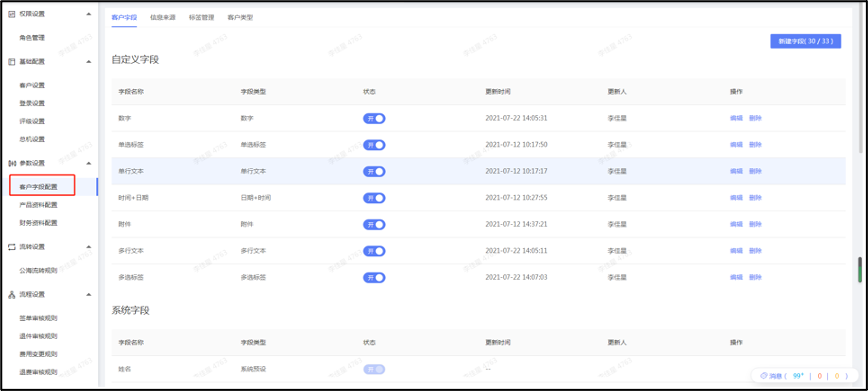
Step2：切换至“客户类型”，点击编辑
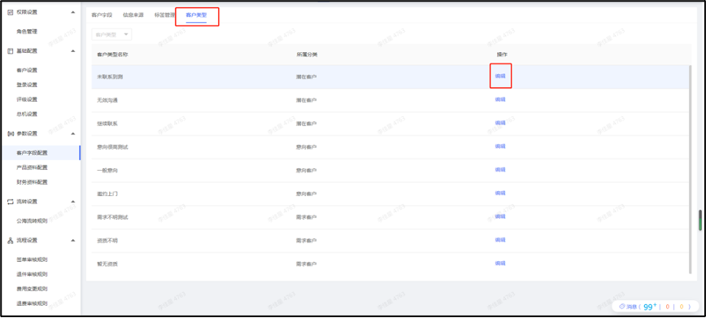
step3：选择大类潜在客户，输入需要的客户类型二类名称，字段类型。如：未联系到

Step4：刷新后就可以在客户细分客户类型啦~
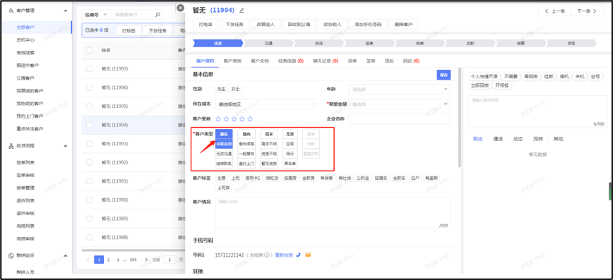

### 8.3.2 产品资料配置
> 说明：按层级配置资方，资方类型-资方名称-产品名称-进件类型

**资方类型**：新增资方类型。

step1：进入客户资料字段设置
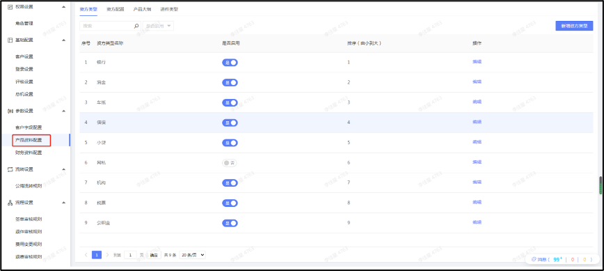
Step2：切换至“资方类型”，点击新增资方类型。
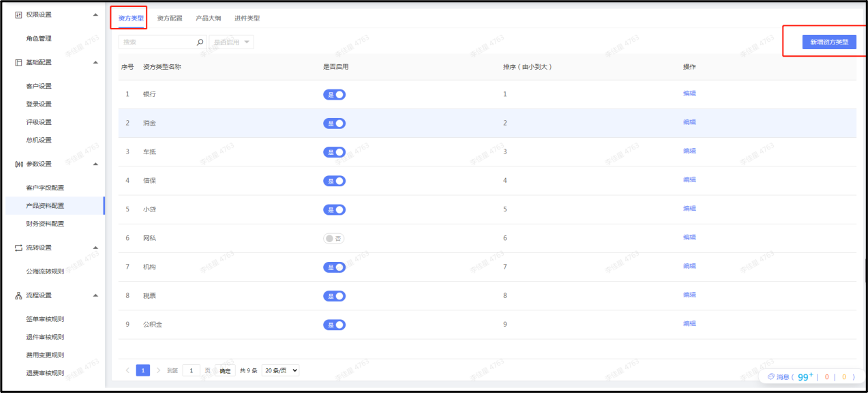
step3：输入需要的资方类型名称。如：银行

**资方配置**：新增资方名称。

Step1：切换至“资方配置”，点击新增资方配置。
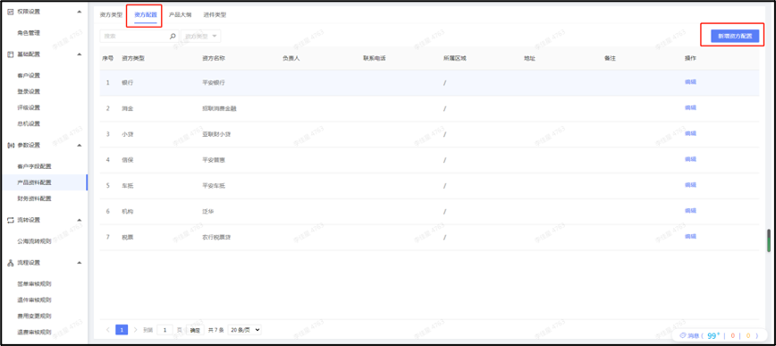
Step2：选择资方类型（一级），输入需要的资方名称。如：工商银行

**产品大纲**：新增产品名称。

Step1：切换至“产品大纲”，点击新增产品大纲。

Step2：选择资方类型-资方名称（一级-二级名称），输入需要的产品名称。如：工商银行抵押贷。如需计算产品成本，可设置产品单价。
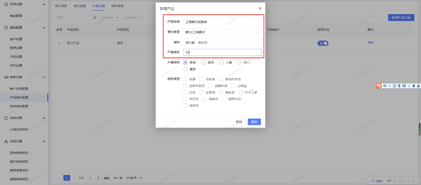
Step3：刷新后就可以在客户表看到啦~
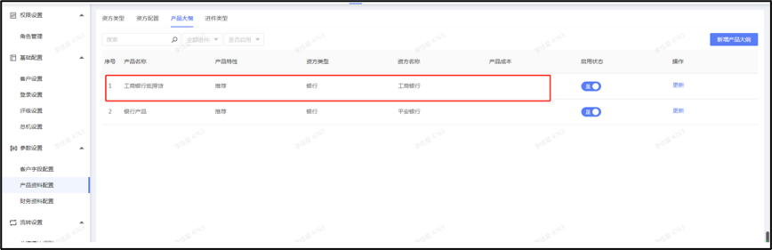
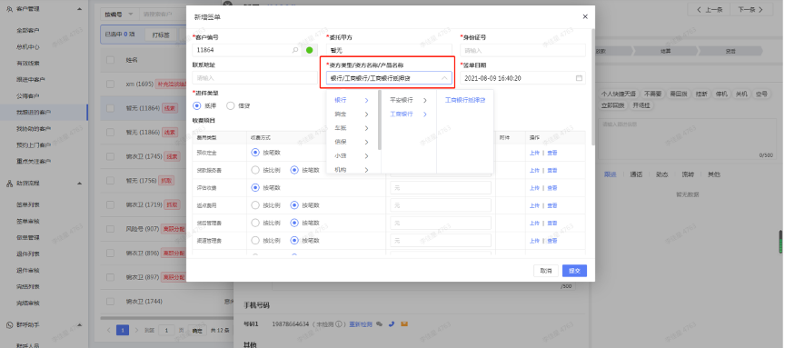

**进件类型**：新增进件类型。

Step1：切换至“进件类型”，点击新增进件类型。
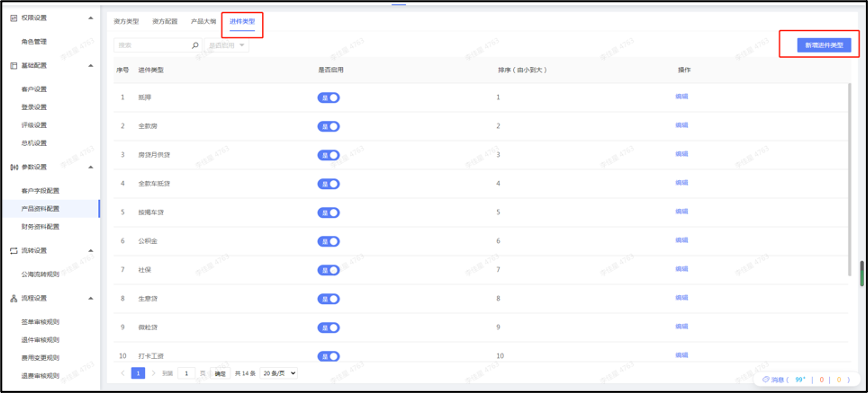
Step2：输入需要的进件类型名称。如：全款车抵贷。

Step3：刷新后就可以在列表看到啦~

Step4：在“产品大纲->更新产品->进件类型”维护进件类型知识库

Step5：在“学习天地->产品大纲”就可以学习产品知识啦~

### 8.3.3 财务资料配置
> 说明：按层级配置资方，资方类型-资方名称-产品名称-进件类型

**费用类别设定**：设置成本分摊。

设置签单收费项目、签单报销项目：一旦新增，不可删除；修改后更新名称。

**提成配置**：按照提成方式，配置区间。

**工资条配置**：添加需要的工资表名称。
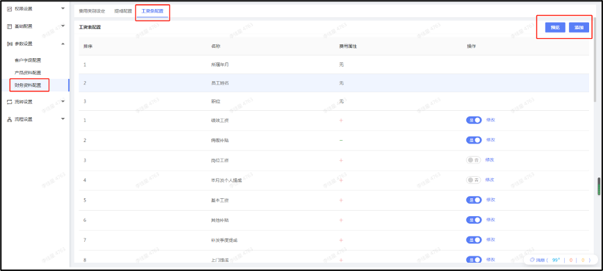

## 8.4 流转设置
> 管理客户流转规则

### 8.4.1 公海流转规则
> 管理公海回收规则

**手动回收**：跟进中的客户，点击“回收到公海”可以解除与客户的关联关系，这部分客户转到“公海客户”池。

**自动回收**：当未成交客户满足任一一条规则时，自动回收到公海池。

PS:若客户跟进人有多个公海，会按公海池顺序回收到排在上的公海；若跟进人没有公海，会回收到默认公海中

**公海回收提醒**：当有客户即将被回收到公海时，会提醒跟进销售。点击通知可以查看所有即将被回收到公海的客户

## 8.5 流程设置
> 管理审核权限流程规则，包括签单、退件、费用变更、退费、报销、报完结审核规则。

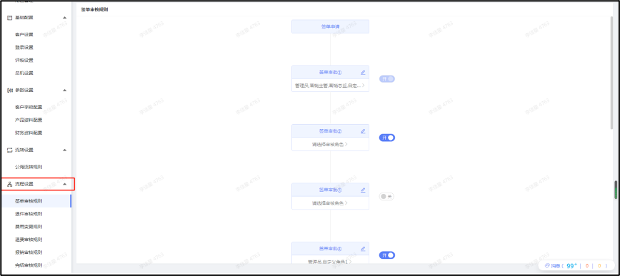

以签单审核规则为例：

Step1：进入“流程设置->签单审核规则”。
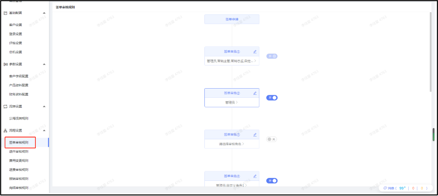
Step2：点击编辑图标修改审核节点名称，如：签单审批③。

Step3：点击“请选择审核角色”，指定角色。

Step4：开启审核节点，该角色就可以在“签单审核”列表审核签单啦~

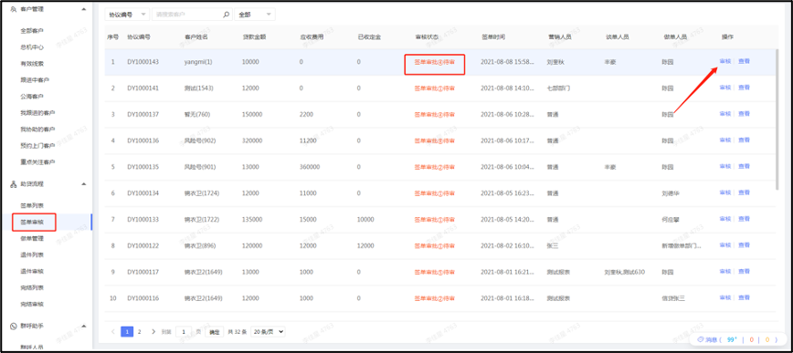

注 ：
1. 无审核角色无法开启审核节点
2.	存在待审的单据，审核节点无法关闭
3.	没有配置审核角色且开启审核节点，相关流程无审核权限
4.	该角色下没有配置相关审核页面，无法配置审核角色
5.	最多支持8个审核节点
6.	按照权限分类【普通、部门、中心、公司】区分数据范围，如①部门主管只能审核所属部门的签单。

