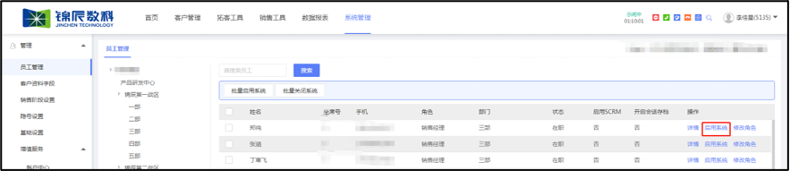
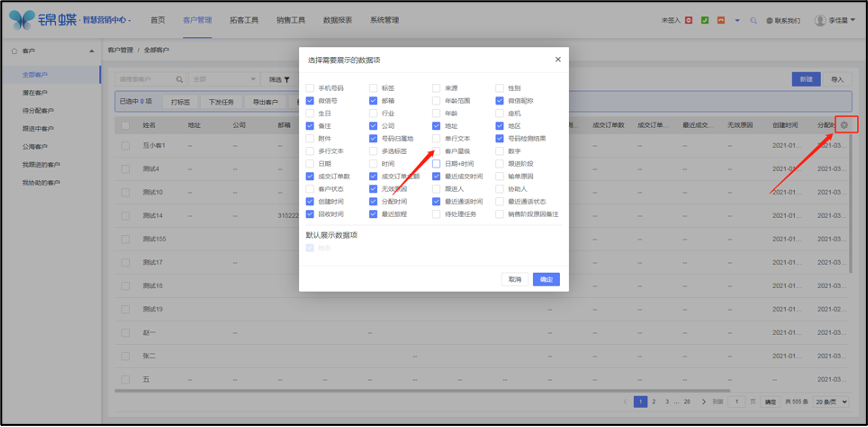
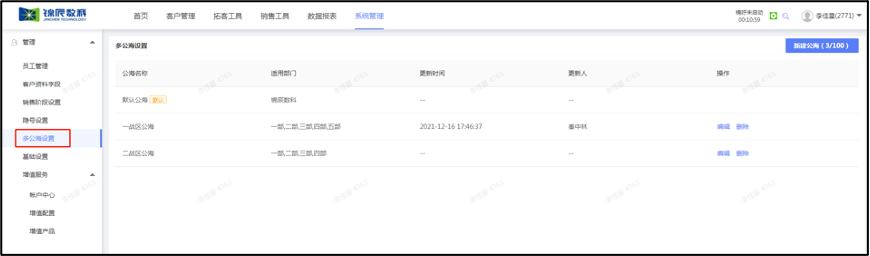
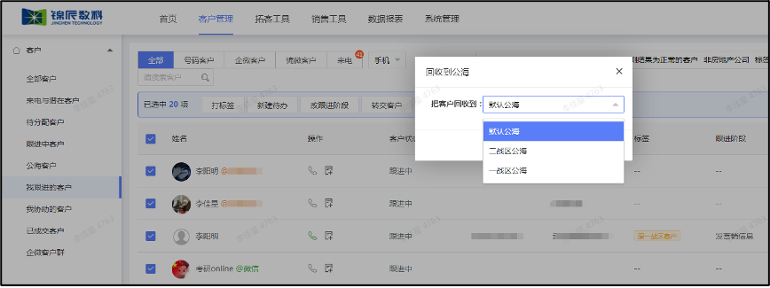
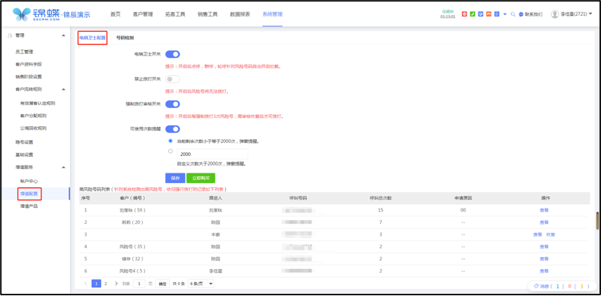
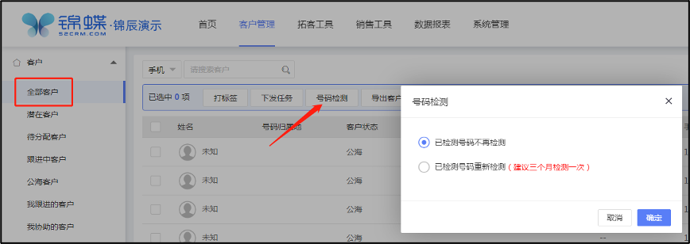
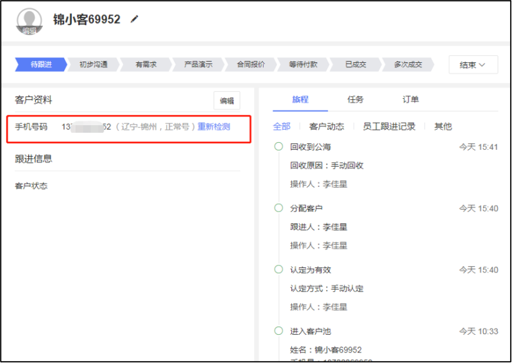
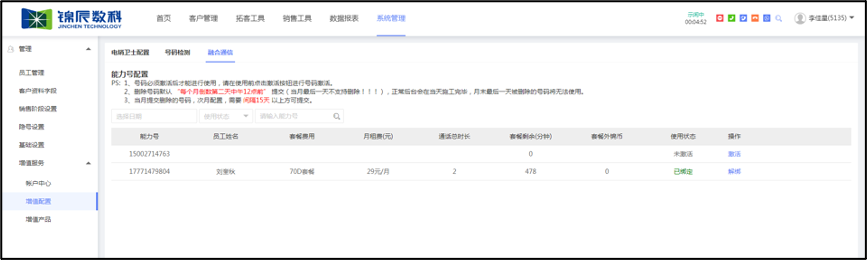
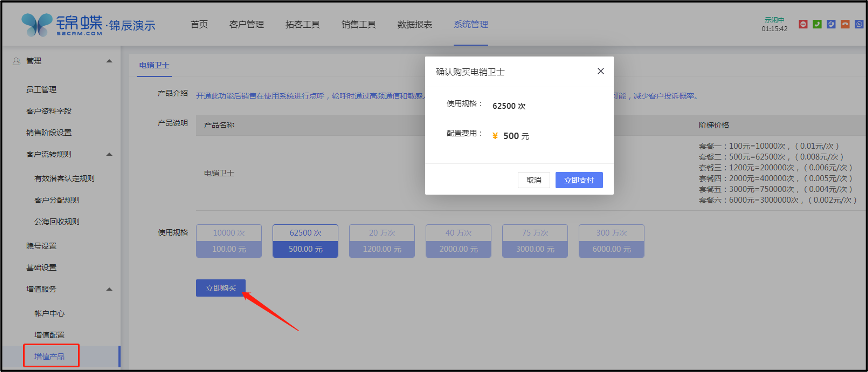

# 第八章 系统管理
<ImageViewer />
在“系统管理”中进行一些系统设置工具

## 8.1 员工管理

作用：赋予不同的数据权限于不同角色，如销售经理、销售主管等，销售主管经理可以查看销售的数据。（默认角色有：企业所有者、企业管理员、运营、销售主管、销售经理。）

操作：在“系统管理”-“员工管理”中进行开启/关闭系统和设置角色的工作

### 8.1.1 角色介绍及角色权限说明

目前存在5个主要角色：

**企业所有者**：拥有所有功能权限，还可在“系统管理-》企业信息”修改企业的名称。

**企业管理员**：所有功能均可使用，可以看到权限范围内的数据，并且做导出和删除，建议分配给公司主要负责人。

**运营**：可以查看所在权限范围内的客户，可以编辑内容模块，建议分配给运营、市场、销售助理。

**销售主管**：可以看到权限范围内的客户，如销售1组的销售主管可以看到销售1组团队内部客户，可以下发任务和浏览本团队数据报表，建议分配给销售组长。

**销售经理**：仅能看到我的客户池、我跟进的客户池和公海，没有任何管理功能，建议分配给一线销售人员。

具体每个角色的数据权限和页面权限，通过下图即可了解~

PS：组织架构同步企业微信后台通讯录。根据现有的业务架构，设置一套合理的组织架构。

注：

1. 不同部门之间的数据相互隔离
2. 销售主管可以看到本部门及下属子部门的数据
3. 普通员工仅看到自己的数据

数据权限管理

只有企业管理员可以增删修改员工信息。针对员工的操作，比如分配客户，改跟进人，转交客户等，对于非企微好友销售主管可以选择所在部门和子部门的员工，企业管理员可以看到所有部门的员工；对于企微好友，改跟进人后，原跟进人将变为协助人。PS：企微好友不可删除、只能在跟进人或协助人间流转。

注：内容的浏览记录，暂未根据组织架构做控制。管理员角色可以看到所有浏览记录，其他角色仅可见自己的
通话记录，暂未根据组织架构做控制。管理员角色可以看到所有的通话记录，其他角色仅可见自己的。

### 8.1.2 开启系统

员工端显示右侧栏和应用的数据，需要后台“启用系统”。 操作：“系统管理”-“员工管理”-找到对应员工“启用系统”

### 8.1.3 分配权限

操作：“系统管理”-“员工管理”-找到对应员工“修改角色”

## 8.2 客户字段设置
管理客户资料字段

### 8.2.1 默认查重字段
一旦录入相同手机号码的客户，不允许新建。

### 8.2.2 新建字段
字段不够用或需要自定义字段名称，通过新建字段功能，管理客户资料字段，你可以在“系统管理-》客户资料字段”页面，点击右上角按钮去【新建字段】，并移动到合适的位置

#### 8.2.2.1 方法一：手动增加字段
支持手动增加单行文本，多行文本，数字，单选标签，多选标签，日期，时间，日期+时间，附件多类型的字段。可以根据自己的需求自定义所需的字段

step1：进入客户资料字段设置

step2：点击新增字段

step3：输入需要的字段名称，字段类型。如：客户星级

step4：点击拖动标签，将字段移动到特定的位置

step5：在客户列表页面，点击设置并选中字段在列表中展示

Step6：刷新后就可以在客户资料中查看到

#### 8.2.2.2 新建分组
客户资料新建字段太多，通过字段分组功能，有条理的管理字段你可以在“系统管理-》客户资料字段”页面，点击右上角按钮去【新建分组】，并移动到合适的位置。

设置分组后，在客户详情页就能按分组框架更有条理的查看客户资料了。

## 8.3 销售阶段设置
管理销售跟进阶段流程

通过销售阶段设置功能，管理跟进阶段你可以在“系统管理-》销售阶段设置”页面，点击跟进阶段下方【+添加阶段】，根据自己的需求自定义所需的跟进阶段，并移动到合适的位置。也可以添加“跟进结束- 输单/无效”原因。

注：已成交”这个字段是系统默认字段，不允许删除或修改。

step1：进入销售阶段设置

step3：点击“+添加阶段”，根据需要自定义。如：多次成交

step4：点击拖动所设置的阶段，移动到特定的位置

step5：在客户列表-客户详情页面跟进阶段中展示

## 8.4 隐号设置
为了保护客户数据不被泄露，可针对部分员工隐藏客户的手机号码。

你可以点击“系统管理->隐号设置”，设置针对哪些员工隐藏客户的手机号码

隐号效果：被设置了隐号的员工，在系统内无法查看客户完整的手机。展示为：150****4763，保护客户的数据安全。

## 8.5 多公海设置
对于有些企业，不同销售团队个您的客户公海是不共享的。比如：一战区销售部放弃跟进的客户，只能丢在一战区公海，由一战区其他销售领取跟进，不允许二战区或其他战区的销售领取。为了满足上述场景，我们增加了“多公海”功能。

### 8.5.1 如何设置
点击“系统管理>管理>多公海设置”，即可管理企业的所有公海池。每个公海可以设置不同的适用部门。

PS：锦蝶SCRM完全同步企业微信组织架构，若在企业微信后台修改了包含公海设置的架构，根据员工所属部门划分公海数据。

### 8.5.2 回收公海
手动点击【回收到公海】的时候，可以把客户回收到自己有权限的公海里

### 8.5.3 导入/新建客户
导入公海：若你直接新建或者导入公海客户，则需要选择客户的所属公海。

### 8.5.4 公海转移
企业管理员可在公海筛选不同公海池数据进行转移维护。

## 8.6 基础设置
配置员工名下最大客户总数、配置我的客户/公海客户导入轮呼限制时间；PS：成交客户及企微客户不占客户总数

## 8.7 增值服务
根据客户需要，为客户提供的超出常规的服务类增值产品

### 8.7.1 账户中心
账户充值、充值/支出记录、消费明细

推出锦币服务

1. 用户可通过支付锦币对相关增值产品进行购买。（100锦币=1元）
2. 用户可随时对自己的余额进行查看，同时能查看充值记录/支出记录。
3. 用户可通过查看消费明细，对过往账户所有的消费情况进行查看。

### 8.7.2 增值配置

#### 8.7.2.1 电销卫士配置

1、用户能对电销卫士进行开启/关闭设置（提示：开启后点呼，轮呼针对风险号码自动开启拦截）

2、用户能对强制拨打审核开关开启/关闭设置（提示：开启后每强制拨打3次风险号，需审核恢复后方可拨打）

#### 8.7.2.2 号码检测

号码检测原理是客户提交的手机号码与三大运营商的实时接口数据进行比对，从而获取手机号的最新状态。基于合规情况下将客户提交的号码进行分类。让客户的营销更加精准有效。具体的名称解释如下：

你可以在“全部客户-》号码检测”，选择已检测号码是否进行重新检测

检测结果可以在客户列表和客户详情的手机号码后面查看

你可以筛选号码检测结果，比如把空号筛选出来后统一删除掉

#### 8.7.2.3 融合通信

能力号配置：由锦辰后台推送已开通的能力号，企业管理员在“增值服务”-”融合通信”进行激活>充值>绑定员工坐席等操作；

PS：

1. 号码必须激活后才能进行使用，请在使用前点击激活按钮进行号码激活。
2. 删除号码默认 “每个月倒数第二天中午12点前” 提交（当月最后一天不支持删除！！！），正常后台会在当天施工完毕，月末最后一天被删除的号码将无法使用。
3. 当月提交删除的号码，次月配置，需要 间隔15天 以上方可提交。

### 8.7.3 增值产品

#### 8.7.3.1 电销卫士-产品介绍
电销卫士功能开启后销售在使用系统进行点呼，轮呼通过高频通信和敏感人群两个维度进行自动拦截，从而降低手机用户被骚扰的可能，减少客户投诉概率。如果客户是风险号会弹出提示框，若开启“增值配置-强制拨打审核开关” ，则只能强制拨打3次，3次后需要提交申请恢复，管理员审核后，可再拨打3次，也可以点击加入黑名单，这个客户就会进入黑名单，该客户就不能呼出。

#### 8.7.3.2 融合通信-产品介绍

融合通信能力开放呼叫原理是：回呼，有些地方叫：双呼。

主叫：A。（一般是客服经理侧）

被叫：B。（一般是客户侧） 

在APP或H5上发送呼叫请求，A（身边固话或手机做为接听终端）先接到协同通信号码（电信手机）的来电后并接起， →B也接到协同通信号码（电信手机）的来电，并接起后，A和B形成通话。AB双方通过手机沟通，看到的都是电信能力号码来电。

操作流程：签署合同>上传合同照片>材料提交审核>平台配置数据>通知已配置号码清单>能力号激活>充值>能力号绑定>设置呼出方式；

